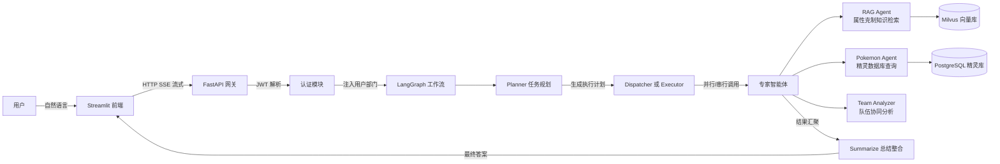

# Roco Kingdom - 洛克王国精灵百科与队伍分析助手

基于多智能体协作的《洛克王国》游戏精灵百科系统，支持自然语言查询精灵信息、属性克制关系、队伍协同分析等。系统采用 LangGraph 实现智能任务规划与调度，集成 Milvus 向量库存储属性克制知识、PostgreSQL 数据库存储精灵数据，并提供 FastAPI + Streamlit 交互界面。

## 🏗️ 架构图



## ## 🚀 快速开始

### 1. 环境要求
- Python 3.10+
- PostgreSQL 15+
- Milvus 2.3+
- Docker Desktop（可选，用于容器化部署依赖服务）

### 2. 配置环境变量
在项目根目录创建 `.env` 文件：

```env
DEEPSEEK_API_KEY=sk-xxxxxxxxxxxxxxxxxxxxx
JWT_SECRET_KEY=请生成一个随机字符串
```

### 3. 启动依赖服务

```bash
# 使用 Docker 启动 PostgreSQL 和 Milvus
docker compose up -d
```

### 4. 初始化数据

```bash
# 初始化 PostgreSQL 表结构及精灵数据
python tools/init_db.py

# 初始化 Milvus 属性克制知识库
python tools/init_milvus.py
```

### 5. 启动服务

```bash
# 启动后端 API
uvicorn api.main:app --reload --host 0.0.0.0 --port 8000

# 新开终端：启动前端
streamlit run frontend/app.py
```

### 6. 访问系统
- 前端界面：http://localhost:8501
- 后端 API 文档：http://localhost:8000/docs

## 📡 API 文档

| 端点 | 方法 | 描述 | 认证 |
|------|------|------|------|
| /token | POST | 获取 JWT 访问令牌 | 无 |
| /chat/stream | POST | 流式多 Agent 问答 | Bearer Token |
| /pokemons | GET | 获取所有精灵列表 | Bearer Token |
| /pokemon/{id} | GET | 获取精灵详细信息 | Bearer Token |
| /metrics | GET | Prometheus 监控指标 | 无 |

### 获取 Token

```bash
curl -X POST "http://localhost:8000/token" \
  -H "Content-Type: application/x-www-form-urlencoded" \
  -d "username=zhangwei&password=secret123"
```

### 流式问答示例

```bash
curl -X POST "http://localhost:8000/chat/stream" \
  -H "Authorization: Bearer <你的token>" \
  -H "Content-Type: application/json" \
  -d '{"messages":[{"role":"user","content":"火系精灵被什么属性克制？"}]}'
```
## ✨ 主要特性

### 🤖 多 Agent 协作
- **Planner**：智能任务规划，分析用户意图并决定调用哪些专家
- **RAG Agent**：从 Milvus 向量库检索属性克制、被克制、抵抗关系
- **Pokemon Agent**：查询 PostgreSQL 数据库中的精灵属性、种族值、特性等信息
- **Team Analyzer**：深度分析队伍打击面、联防弱点、抵抗覆盖
- **Summarize Agent**：整合多 Agent 结果，生成最终回答

### 🧠 智能任务调度
- 自动识别并行/串行任务关系
- 例如："先查火系精灵，再分析它们的克制关系" → 串行执行
- 例如："火系精灵被什么克制？种族值是多少？" → 并行执行

### 📚 属性克制知识库
- 基于 Milvus 向量数据库存储 18 种单属性 + 双属性组合的克制关系
- 支持单属性查询（如"火系"）和双属性查询（如"火系+水系"）
- 包含属性优势、劣势、联防价值分析

### 📊 精灵数据库
- **pokemon**：精灵基本信息（编号、名称、属性、特性）
- **pokemon_stats**：种族值详情（HP、物攻、物防、魔攻、魔防、速度）
- **natures**：性格系统（增益/减益属性）
- **moves**：技能信息（威力、能量消耗、伤害类别）
- **pokemon_moves**：精灵可学技能关联

### 💬 流式输出
- 通过 Server-Sent Events (SSE) 实现实时进度反馈
- 打字机效果展示分析过程

### 🔐 JWT 认证
- 用户登录认证
- Token 有效期管理

## 🎮 支持的精灵属性

| 属性 | 属性 | 属性 |
|------|------|------|
| 火系 | 水系 | 草系 |
| 光系 | 恶系 | 幽系 |
| 普通系 | 地系 | 冰系 |
| 龙系 | 电系 | 毒系 |
| 虫系 | 武系 | 翼系 |
| 萌系 | 机械系 | 幻系 |

## 💡 使用示例

### 查询精灵信息
> "火神的属性和种族值是多少？"

### 查询属性克制
> "火系被哪些属性克制？"

### 双属性分析
> "火系+翼系精灵有什么优劣势？"

### 队伍分析
> "帮我分析这个队伍的打击面和联防弱点"（配合队伍数据）

### 综合查询
> "找出种族值最高的火系精灵，并分析它的属性克制关系"

## 🧱 项目结构

```
rock_kingdom/
├── agents/                    # 各智能体节点
│   ├── planner.py            # 任务规划器
│   ├── dispatcher.py         # 任务分发器
│   ├── rag_agent.py          # 属性克制知识检索
│   ├── pokemon_agent.py      # 精灵数据库查询
│   ├── team_analyzer.py      # 队伍协同分析
│   └── summarize.py          # 结果总结整合
├── tools/                     # 工具封装
│   ├── sql_executor.py       # PostgreSQL 执行器
│   ├── retriever.py          # Milvus 检索器
│   ├── rag_tools.py          # RAG 工具
│   ├── db_tools.py           # 数据库工具
│   └── team_utils.py         # 队伍分析工具
├── core/                      # 核心模块
│   ├── state.py              # 状态定义
│   ├── graph.py              # LangGraph 工作流
│   ├── llm.py                # LLM 配置
│   ├── memory.py             # 历史记忆管理
│   └── metrics.py            # 监控指标
├── api/                       # FastAPI 应用
│   ├── main.py
│   └── dependencies/
│       └── auth.py           # JWT 认证
├── frontend/                  # Streamlit 界面
│   └── app.py
├── config/                    # 配置与提示词
│   └── prompts.py
├── data/                      # 数据文件
│   ├── documents/             # 知识库文档
│   ├── teams/                # 队伍数据
│   └── elements/             # 属性图标
└── README.md
```
📄 许可
本项目基于 MIT License 开源，仅供学习与展示使用。实际企业部署时请替换所有默认密码与密钥。
